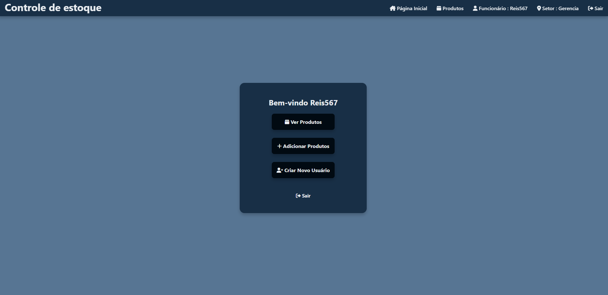
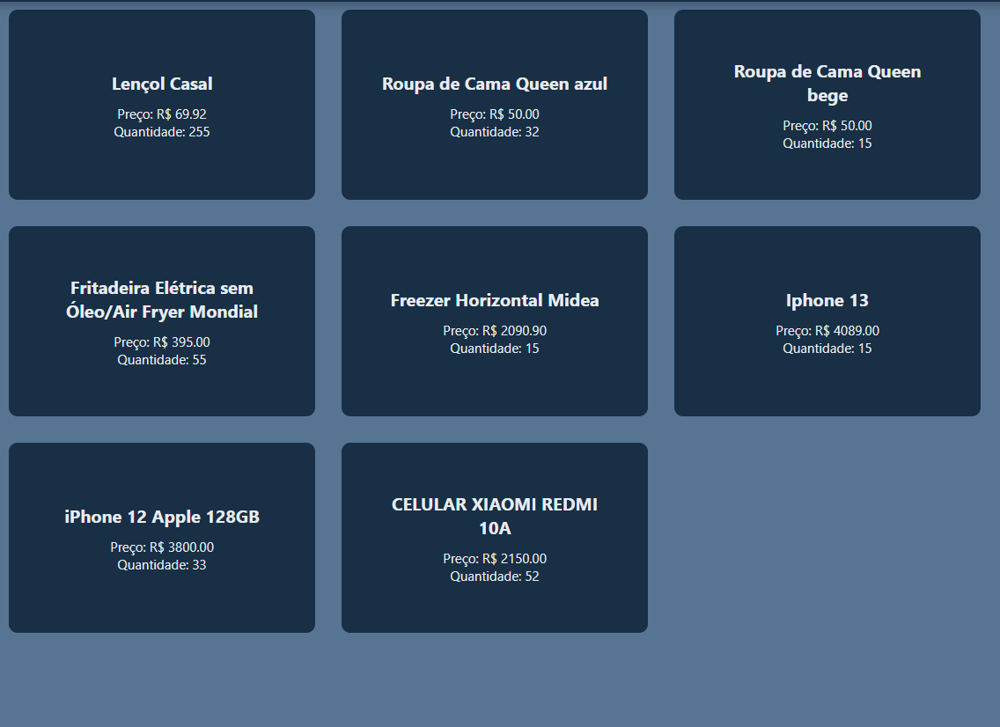
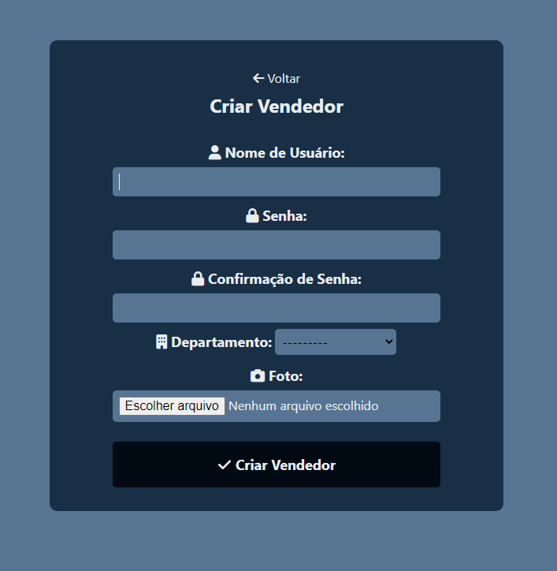
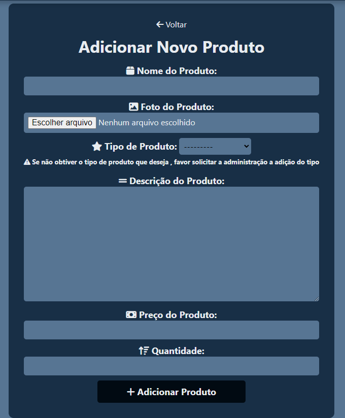

# Inventory Management System

Welcome to the Inventory Management System, a project to manage products and vendors in an e-commerce environment. This project was developed by [Reis567](https://github.com/Reis567).



## Project Screens

Here are some screenshots of the project:

### Login Screen


### Product Details Screen


### Products Screen



### Add New Vendor Screen



### Add New Product Screen



## Overview

This project is a CRUD (Create, Read, Update, Delete) system built with the Django framework. It allows you to perform the following tasks:

- Create, read, update, and delete products.
- Associate products with types and departments.
- Create, read, update, and delete vendors, associating them with departments.

## Prerequisites

Before you begin, make sure you have the following installed on your machine:

- Python 3.x
- Django 4.x

## Installation

1. Clone this repository:

   ```bash
   git clone https://github.com/Reis567/storage-management.git
   ```

2. Navigate to the project directory:

   ```bash
   cd storage-management
   ```

3. Install the dependencies:

   ```bash
   pip install -r requirements.txt
   ```

4. Apply database migrations:

   ```bash
   python manage.py migrate
   ```

## Usage

1. Start the development server:

   ```bash
   python manage.py runserver
   ```

2. Access the system in your web browser at `http://127.0.0.1:8000/`.

3. To access the administration panel, go to `http://127.0.0.1:8000/admin/` and log in with the administrator credentials.

## Additional Features

- The system includes a Django administration interface for managing products, product types, departments, vendors, and users.
- Products are organized by departments, and vendors are associated with departments.
- Users can be created through administration and linked to a department and a profile picture.

## Contact

- [Reis567](https://github.com/Reis567)


## PORTUGUÊS

# Sistema de Controle de Estoque 

Bem-vindo ao Sistema de Controle de Estoque, um projeto para gerenciar produtos e vendedores em um ambiente de comércio eletrônico. Este projeto foi desenvolvido por [Reis567](https://github.com/Reis567).


## Telas do Projeto

Aqui estão algumas capturas de tela do projeto:

### Tela de Login


### Tela de Detalhes do Produto


### Tela de Produtos


### Tela de Adicionar Novo Vendedor


### Tela de Adicionar Novo Produto


## Visão Geral

Este projeto é um sistema CRUD (Create, Read, Update, Delete) construído com o framework Django. Ele permite que você realize as seguintes tarefas:

- Crie, leia, atualize e exclua produtos.
- Associe produtos a tipos e departamentos.
- Crie, leia, atualize e exclua vendedores, associando-os a departamentos.

## Pré-requisitos

Antes de começar, certifique-se de ter o seguinte instalado em sua máquina:

- Python 3.x
- Django 4.x

## Instalação

1. Clone este repositório:

   ```bash
   git clone https://github.com/Reis567/storage-management.git
   ```

2. Navegue até o diretório do projeto:

   ```bash
   cd storage-management
   ```

3. Instale as dependências:

   ```bash
   pip install -r requirements.txt
   ```

4. Aplique as migrações do banco de dados:

   ```bash
   python manage.py migrate
   ```

## Uso

1. Inicie o servidor de desenvolvimento:

   ```bash
   python manage.py runserver
   ```

2. Acesse o sistema no seu navegador em `http://127.0.0.1:8000/`.

3. Para acessar o painel de administração, vá para `http://127.0.0.1:8000/admin/` e faça login com as credenciais de administrador.

## Funcionalidades Adicionais

- O sistema inclui uma interface de administração Django para gerenciar produtos, tipos de produtos, departamentos, vendedores e usuários.
- Os produtos são organizados por departamentos, e os vendedores estão associados a departamentos.
- Os usuários podem ser criados pela administração e vinculados a um departamento e uma foto.

## Contato

- [Reis567](https://github.com/Reis567)
